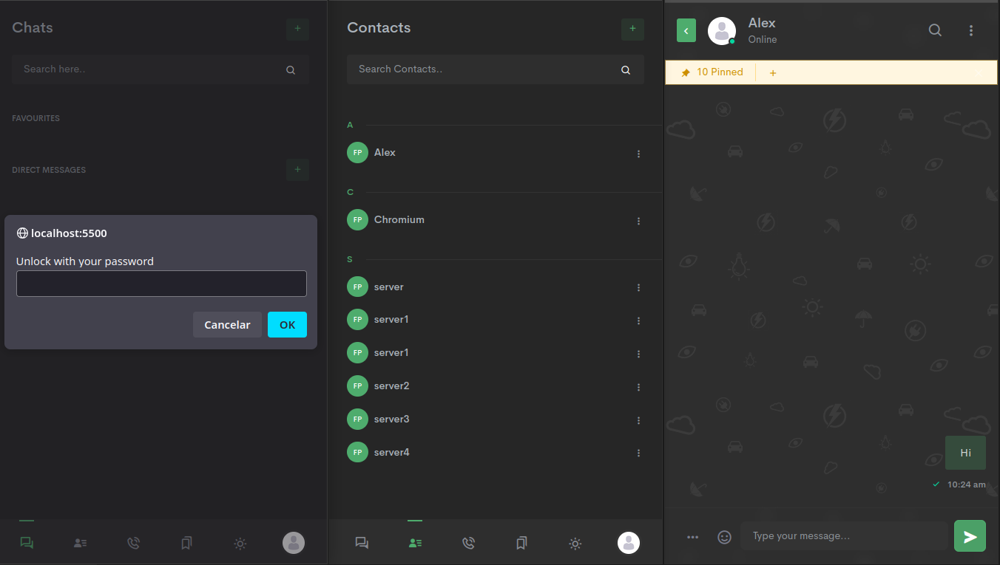

# Web3 Social Media P2P
**Note: This project is deprecated and no longer maintained.**

## 📝 Overview

Web3-Social-Media-P2P is a decentralized social media platform leveraging Web3 technologies to ensure privacy, security, and user control over data.

## ✨ Features

- Decentralized architecture
- Enhanced privacy and security
- User-controlled data
- Peer-to-peer communication

## 🛠️ Installation

To install and run the project locally, follow these steps:

1. Clone the repository:
    ```bash
    git clone https://github.com/denisdss/Web3-Social-Media-P2P.git
    ```
2. Navigate to the project directory:
    ```bash
    cd Web3-Social-Media-P2P
    ```
3. Install dependencies:
    ```bash
    npm install
    ```
4. Start the application:
    ```bash
    npm start
    ```

## 🚀 Usage

After starting the application, open your browser and navigate to `http://localhost:8080` to access the platform.

## 📚 Documentation



## 🤝 Contributing

Feel free to submit pull requests or open issues!

## 📜 License

This project is licensed under the MIT License.

## 📬 Contact

Denis DSS - Software Engineer
[[denisdss@outlook.com](mailto\:denisdss@outlook.com)]

## ☕ Pay me a Coffee

Ethereum Network: 0x0F8D4366ff23ee657B8aC5713C4E1591976C46c2

PIX Brazilian Network: fc6efbb0-287c-498c-b4aa-e5c70578d6ab

Paypal Donation: https://www.paypal.com/donate/?business=P2HRRJZ3YZWHW&currency_code=USD

Buy me a coffee APP: http\://buymeacoffee.com/denisdss
